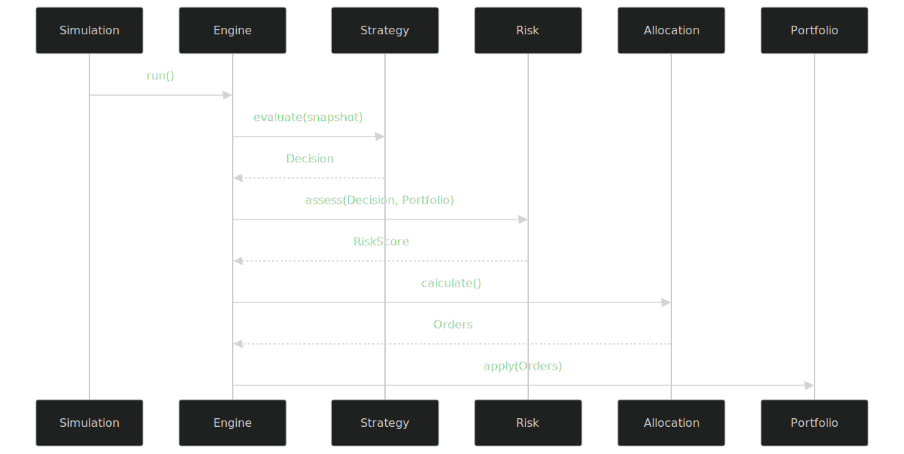

📘 Quant Engine

---

## 1. Project Overview

- 전략 자동 실행 프로그램 아님
- 투자 의사결정 구조화, 분리, 설명 가능성 확보
- 설계 중심 지향

**핵심 목표**
- 전략/상태 분리
- 리스크 정책 독립성
- 실행 흐름 명확화
- 확장성 중심 아키텍처

---

## 2. Core Principles

### 2.1 Stateless Strategy
- `MarketSnapshot` → `Decision`
- 전략은 상태 저장 금지 (순수 함수형)
- **보장:** 테스트 용이성, 전략 교체, 병렬 실행, 추론 가능성

### 2.2 Risk as Policy Layer
- 리스크는 근거(설명) 제공
- **리턴:** RiskScore, 적용 Rule 목록, 사유 메시지
- 의사결정은 설명 가능해야 함

### 2.3 Engine as Orchestrator
- 엔진이 각 단계 조율
- **흐름:**  
  1. Snapshot  
  2. Strategy  
  3. Risk 평가  
  4. Allocation  
  5. Order  
  6. Portfolio  
- 각 단계 독립적 교체 가능

### 2.4 Domain Isolation
- **패키지:**  
  - engine/
  - strategy/
  - risk/
  - order/
  - portfolio/
- **규칙:**  
  - strategy ≠ portfolio 참조  
  - risk는 engine 상태 변경 금지  
  - order는 전략 모름  
  - engine만 전체 흐름 파악

### 2.5 Immutability First
- **기본 immutable:**  
  - MarketSnapshot  
  - Decision  
  - RiskScore  
  - Order  
- 상태 변경은 Engine에서만

---

## 3. Dependency Structure

- 계층적 의존성
- Engine이 모든 도메인 조율
- **원칙:** 도메인 간 직접 참조 금지, 각 도메인은 자기 책임만

---

## 4. Execution Sequence (Phase 0)

- Strategy가 Portfolio 직접 수정 X
- Risk는 판단만
- Portfolio는 Order 통해서만 변경

---

## 5. Architecture Decision Records (ADR)

- 설계 결정 기록(근거 중심)
- **ADR-001:** Stateless Strategy  
  - Context: 전략에 상태 있으면 테스트/확장 어려움  
  - Decision: 순수 입력 기반  
  - Consequences: 전략 교체 쉬움, 병렬 실행, 상태 집중

- **ADR-002:** Risk as Independent Policy  
  - Context: 전략 내부 리스크 → 설명성 저하  
  - Decision: 독립 Policy Layer  
  - Consequences: 역할 분리, 룰 교체/추적

- **ADR-003:** Engine as Single State Owner  
  - Context: 다중 상태 변경 → 디버깅 불가  
  - Decision: Engine/Portfolio만 상태 변경  
  - Consequences: 추적 단순, 안정성 확보

---

## 6. Phase Roadmap

- **Phase 0:** Engine Core  
  - Stateless Strategy 정립, RiskScore 구조화, DailySimulation, Order→Portfolio 적용, 콘솔 결과

- **Phase 1:** 구조 강화  
  - 단위 테스트, 인터페이스, 리팩토링, 경계 강화

- **Phase 2:** API Layer  
  - Spring Boot REST API, 외부 전략 지원

- **Phase 3:** Visualization  
  - 결과 시각화, 리스크 대시보드

- **Phase 4:** AI Integration  
  - 성능 분석, 리스크 가중치 자동화, 최적화

---

## 7. Non-Goals

- 단기 수익 극대화 X
- 무계획 실험장 X
- 아키텍처 원칙 위반 X

---

## 8. Long-Term Objective

- 4년 후:  
  - 투자 의사결정 시스템 설계 및 설명
  - 논리적 트레이드오프 정리 가능한 엔지니어

> 코드는 변하나 설계 사고는 남는다.
